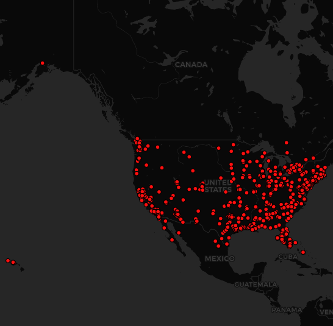

# Lab 2: Geo-tagged tweet collection and visualization

It appears that the distribution of tweets with a keyword "quarantine" in the US is heavier on the Eastern side of the country, with a particular focus on the coast. Additionally, there seems to be a heavy focus of tweets on the West coast as well. One could assume that the coastal cities have more population density meaning that those who are tweeting about quarantine during the current COVID-19 pandemic, would appear closer on the map, as seen on both the East and West coasts of the US in this distribution.
